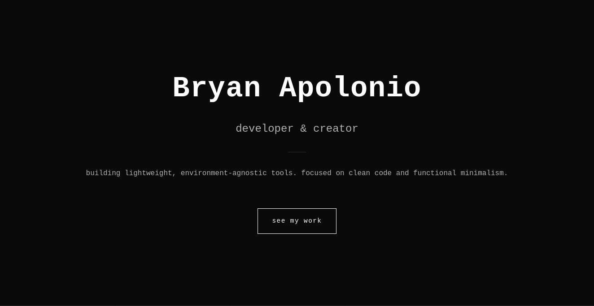

# Bryan Apolonio

A simple, brutalist personal website.

  

## Overview

This is a minimal, no-frills personal portfolio. No unnecessary decorations. No animations. Just content.

A digital representation built with simplicity and clarity in mind.

## Features

- **Minimalist Design:** High-contrast, low-entropy interface
- **Fast Loading:** Static HTML/CSS, optimized for performance
- **Responsive:** Works on all screen sizes
- **Zero Dependencies:** Pure HTML, CSS, and vanilla JavaScript (if needed)

## License

MIT License - You are free to use, modify, and distribute this code.

See the [LICENSE](./LICENSE) file for more details.

---

**Built with no bullshit.**
